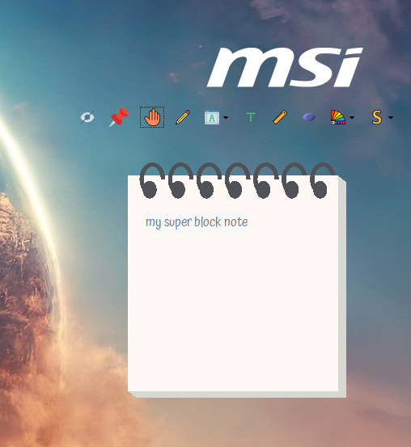
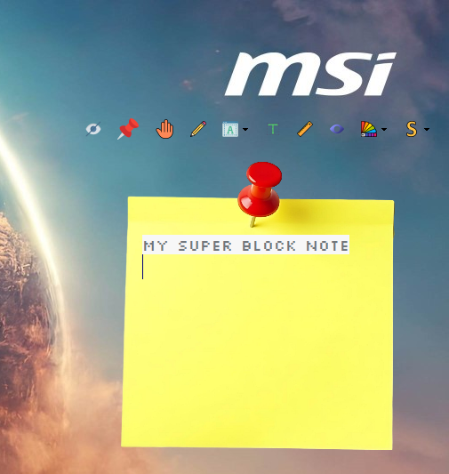
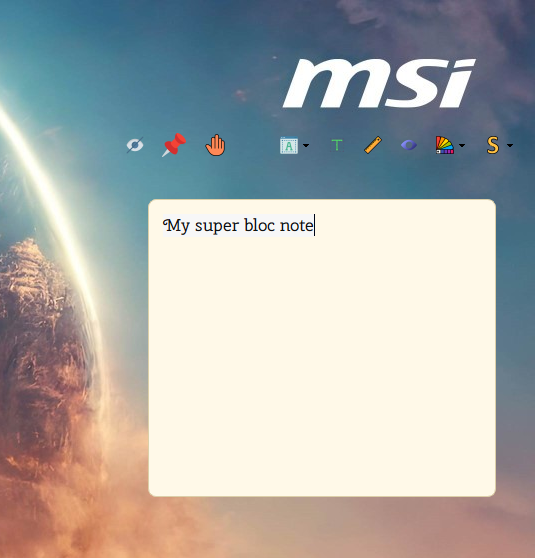

# Bloc Note Épinglé

Floating PySide6 sticky note app (rich text, themes/textures, gradients/colors, custom fonts, opacity, resize dialog, global hotkey on Windows) with user data stored in AppData.

## Requirements
- Python 3.10+
- PySide6 (see requirements.txt)
- Windows for installer and global hotkey; Linux/macOS can run the app but without the Windows-only hotkey/autostart.

## Run from source

### Windows (PowerShell)
```powershell
python -m venv .venv
.\.venv\Scripts\activate
pip install -r requirements.txt
python main.py
```

### Linux (bash)
```bash
python3 -m venv .venv
source .venv/bin/activate
pip install -r requirements.txt
python main.py
```

## Build standalone binary

### Windows
```powershell
.\.venv\Scripts\activate
python -m PyInstaller --clean --noconfirm BlocNoteEpinglé.spec
```
Output: `dist/BlocNoteEpinglé.exe`

### Linux
```bash
source .venv/bin/activate
python -m PyInstaller --clean --noconfirm BlocNoteEpinglé.spec
```
Output: `dist/BlocNoteEpinglé`

## Windows installer
- Requires Inno Setup 6 (ISCC).
- After building `dist/BlocNoteEpinglé.exe`:
```powershell
"C:\Program Files (x86)\Inno Setup 6\ISCC.exe" blocnote.iss
```
- Installer is produced in `Output/`.

## Download
- Latest release (installer & portable): https://github.com/T4zor/Super-Bloc-Note-/releases/latest

## Data and resources
- User data (notes, configs) lives in the user AppData directory and is ignored by git via `.gitignore`.
- Bundled resources: `icon.ico`, `app image/`, `nav/`, `fonts/`.

## Platform notes
- Global hotkey (Ctrl+H) and autostart (registry Run key) are Windows-only.
- On Linux/macOS these features are skipped; the rest of the app works from source or PyInstaller build.

## Screenshots

| Preview 1 | Preview 2 | Preview 3 |
| --- | --- | --- |
|  |  |  |

## Shortcuts
- Ctrl+H (Windows): toggle visibility (global hotkey, registered on Windows only).
- Ctrl+B/I/U: bold / italic / underline in the editor.
- Ctrl+Wheel: change zoom (Qt default) — note: custom size dialog also available.

## Navigation bar (left to right)
- Hide: show/hide the top bar.
- Pin: keep window on top.
- Drag: hold to move the window (or click/drag empty area when commands are hidden).
- Margin adjust (pencil): edit text margins (only for image themes; hidden otherwise).
- Font: choose font family (applies to selection or next typed text).
- Size: open font size dialog.
- Resize: open window resize dialog (percentage of base size).
- Opacity: open opacity dialog (0.3–1.0).
- Color: choose solid/gradient colors for text.
- Style: choose theme/texture; also custom image or color for background.
